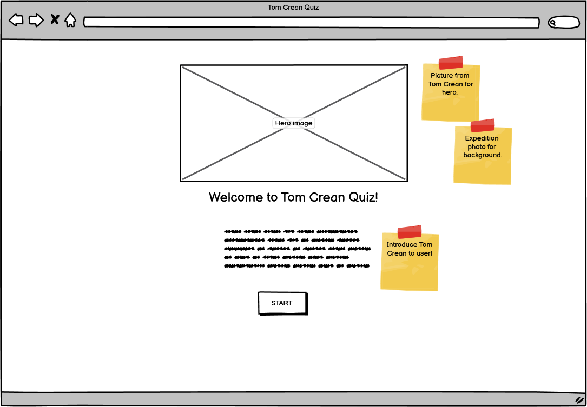

 # TOM CREAN QUIZ

 Link to live page:https://tetapehta.github.io/Tom-Crean-Quiz/

 In this Quiz is for users that already have the knowlege of Tom Crean and his explorations to the Sout Pole, 
 and for users that had never heard of him. Questions and anwsers are humorus in nature and help the User gain historical knowlege 
 about Tom Crean and have fun while learning. It composes 4 possible anwsers to the question. In the end of the Quiz links are presented for Users that would like to learn more about the Antartic Explorer.

 ## Contents
 
 ### UX
  This quiz is ment to educate the User about Tom Crean and his Antartic Explorations. If Users does not anwser all questions correct, they can start from the begining.
 ### Am I responsive

 ### Design
  ## Failed design
   My design as per Wireframes has failed. Due to time constraint and failed code, I did not implement all of the elements as wished in the begining of the project.
 
 ### Langugaes used
  Languages used in this project: HTML, CSS, JS.
 ### Frameworks
     Frameworks were build using Balsamiq

- Desktop 

- Mobile

    

## BUGS
1. JS for True and False statments
⋅⋅⋅When inspecting my progress in deployed site I have noticed, that my understanding of JS regarding the True and False statments is wrong. I thought that I can create more that one false statment. I have reverted back to student content in JS Essentials and Love Math Project, for better understanding.
FIX:
Will Implement the changes in HTML and JS structure for Multiple Choice Quiz.

2. Start Quiz 
⋅⋅⋅When re-building the quiz into correct form, I have merged quiz.html and index.html. Missing the function for start of Quiz.
FIX:
Added the funtion in JS.

4. JSHint
⋅⋅⋅I was not able to fix the JSHint SubmitButton undefined variable. When fixing the code the error did not present in DevTools anymore.

5. HTML

6. CSS

## Lighthouse

## CREDIT 

1. Code Explained: Watched, wrote and re-wrote this tutorial from:[Code-Explained-JS] (https://www.youtube.com/watch?v=49pYIMygIcU)
2. Code Studio: [Code Ninja - JS tutorial on True and False ](https://www.codingninjas.com/)
3. Foolish Developer: [Simple Quiz App Using JS](https://foolishdeveloper.com/javascript-quiz-app/)

## THANKS

I would like to thank my Mentor, Student care and Tutor support. 
This was a very hard project for me to grasp and I'm aware of its faults and shortcommings.
I will have to devote more time to learn JS. 